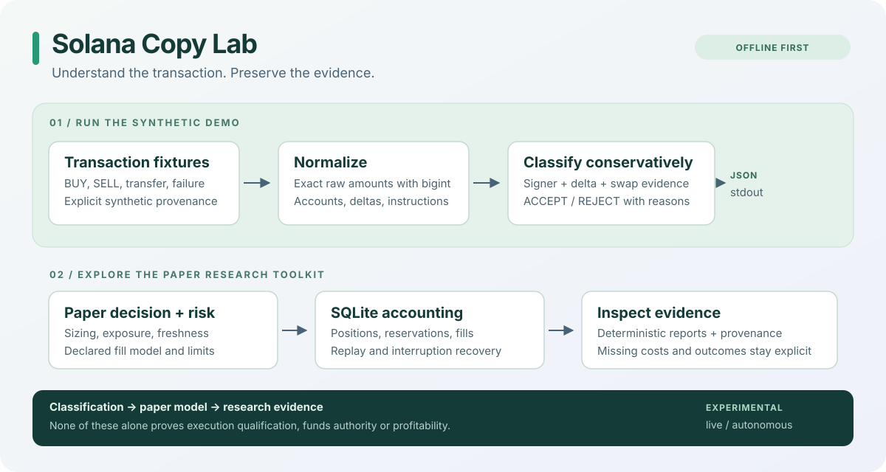

# Solana Copy Lab

[](https://github.com/hu4927862-debug/solana-copy-lab/actions/workflows/ci.yml) [](LICENSE) [](package.json)

**Understand a wallet trade before you copy it.**

An offline-first research toolkit for Solana wallet activity: conservative swap classification, exact integer amounts, paper accounting, durable risk gates, and reproducible evidence reports.

[简体中文](README.zh-CN.md) · [Quick start](#quick-start) · [Usage & troubleshooting](docs/USAGE.md) · [Capability evidence](docs/CAPABILITIES.md) · [DEX boundaries](docs/DEX-SUPPORT.md) · [Contribute](#contributing)



## Why this exists

A token balance change can come from a swap, a transfer, rent, a fee, or a liquidity operation. Copying the change without understanding its cause produces misleading signals. A quote used as a paper fill also leaves real execution costs and landing outcomes unresolved.

Solana Copy Lab makes those distinctions inspectable. It is useful for building transaction analysis tools, reproducing decoder bugs, checking paper position accounting, and reviewing whether a research conclusion has enough evidence behind it.

## Quick start

Use the tested **Node.js 24** and **pnpm 11.22.0** toolchain, pinned in `package.json`. Corepack is optional; if you use it, its pnpm command reads that pin. Otherwise select the pinned pnpm version with your usual package manager.

```sh
git clone https://github.com/hu4927862-debug/solana-copy-lab.git
cd solana-copy-lab
pnpm install --frozen-lockfile
pnpm demo
pnpm demo:workflow
pnpm check
```

Installation downloads dependencies. The demo and default tests then run locally without RPC credentials or a wallet. Tests use fixed fixtures, temporary SQLite databases and, where needed, local mock servers. `better-sqlite3` is a native dependency; keep `pnpm-workspace.yaml`, which permits its build.

If installation fails, start with [toolchain and native SQLite troubleshooting](docs/USAGE.md#troubleshooting). Do not disable all dependency build controls. Linux and macOS CI results are visible in the badge; Windows support is not claimed.

### A complete paper workflow

`pnpm demo:workflow` connects the existing classifier, copy engine, PRE/POST risk,
SQLite Store, paper fill model and evidence reporter. It uses labeled synthetic
transactions and an in-memory quote provider; **zero provider requests** occur.

The workflow retains the results of accepted, duplicated, rejected and missing
evidence cases, applies a synthetic BUY and FULL SELL, and writes a new temporary
directory containing a summary, exact input/quote receipts, `paper.sqlite`, JSON
and Markdown evidence reports, and a hash manifest. Its report remains
`INSUFFICIENT_EVIDENCE`; a closed paper position is not a real finalized trade.

```sh
# Optional output: this directory must not already exist
pnpm demo:workflow --output ./offline-example

# Minimal, readable TypeScript classification call
pnpm example:classify
```

Read [the artifacts and source-level API example](docs/USAGE.md). No API keys,
database preparation or wallet setup are needed. `pnpm start` retains the small
classification demo below.

### What the demo shows

`pnpm demo` runs the existing normalizer and classifier against five **synthetic** transactions. It prints JSON containing:

| Case                                      | Output                                          |
| ----------------------------------------- | ----------------------------------------------- |
| Swap spending SOL and receiving a token   | `ACCEPT`, `BUY`                                 |
| Swap spending a token and receiving SOL   | `ACCEPT`, `SELL`                                |
| BUY above JavaScript's safe integer limit | Exact token raw amount `"9007199254740993"`     |
| Ordinary token transfer                   | `REJECT`, `ORDINARY_TRANSFER`, readable reason  |
| Failed transaction                        | `REJECT`, `TRANSACTION_FAILED`, readable reason |

Raw amounts stay `bigint` inside the decoder and become decimal strings in JSON. The demo opens no database and imports no network, signer, collector or sealed Research owner. Its accepted BUY is a decoded observation, not an instruction to trade.

## What you can use

| Capability                                          | Where to start                                                       | Meaning and limit                                                                                 |
| --------------------------------------------------- | -------------------------------------------------------------------- | ------------------------------------------------------------------------------------------------- |
| Normalize transactions and classify swaps           | [`src/decoder`](src/decoder), [`test/fixtures`](test/fixtures)       | Uses signer, asset deltas and allow-listed swap evidence; rejects unsupported or ambiguous cases. |
| Inspect sizing and paper risk decisions             | [`src/copy`](src/copy), [`src/risk`](src/risk)                       | Deterministic copy policy, exposure limits, freshness and provider health gates.                  |
| Track paper positions and recover from interruption | [`src/persistence`](src/persistence), [`src/recovery`](src/recovery) | SQLite persistence, reservations, fill application and restart tests.                             |
| Review research evidence                            | [`src/strategy-evaluation`](src/strategy-evaluation)                 | Cost completeness, round trips, comparability, missing evidence and deterministic reports.        |
| Investigate provider behavior                       | [`src/network`](src/network), [`src/stream`](src/stream)             | Transport, pacing and stream recovery code; live use needs separate configuration.                |

The fixed fixture collection includes synthetic cases, eight reconstructed
minimized historical observations and four larger provider-neutral JSON inputs.
The original full RPC capture chain is not published. See
[fixture provenance](test/fixtures/README.md); the five-case demo uses only
synthetic cases.

### Replay saved inputs and inspect review boundaries

```sh
# Read four checked-in provider-neutral snapshots; no RPC or fresh observation
pnpm demo:replay

# Exercise real byte-review checks with synthetic unsigned input
pnpm demo:review
```

Replay reports exact amounts, input-file hashes, chain timestamps, a separately
labeled local replay clock and the candidate-wallet evidence boundary. It does
not establish full capture provenance or historical market coverage.

The byte-review example calls the existing independent reviewer with synthetic
messages. Its baseline is **expected to block** at `CPI_EVIDENCE_REQUIRED`, and
negative cases exercise selected wallet, program, account, amount and message
boundaries. An expected block is not a successful transaction review or a
qualified BUY/SELL. It performs no live build, chain simulation, signing or send.

The [capability evidence map](docs/CAPABILITIES.md) links actual input/output
fields, owners, tests and limitations. RPC adapters, DEX recognition and failure
handling exist in source; their offline coverage is distinct from live access,
execution qualification and current program attestation.

[DEX support boundaries](docs/DEX-SUPPORT.md) separates source instruction
recognition, provider quote labels and historical execution checks. A Jupiter
label or Raydium AMM classification must not be read as qualified CLMM execution.

## Evidence boundaries

- Decoder acceptance means the supported transaction evidence satisfies the classifier. It does not establish a qualified FOLLOW event or a safe follower trade.
- Paper fills use a declared model. A quote is not a landed fill, and paper accounting is not realized live profit.
- Missing costs and outcomes remain explicit. A verdict can be `INSUFFICIENT_EVIDENCE`; unknown values should not become zero.
- This public snapshot establishes no alpha, profitability, turnkey autonomous operation or permission to trade. The publication does not restart a collector or launch live execution.

### Experimental execution sources

`src/live` and `src/autonomous` preserve experimental transaction review,
execution, signing-policy and responsibility code for inspection. Selected pure
byte-review boundaries have public synthetic tests; complete historical
execution/qualification suites remain outside the public distribution. Private
operational evidence, the pinned sealed Research dependency closure, signer
credentials and program-attestation binary artifacts are **not included**.

A fresh clone cannot complete the autonomous runtime checks or execute that historical deployment. A successful TypeScript build checks source compilation; it does not supply the missing closure, copy all runtime assets, qualify execution, or confer funds authority. Review these modules as experimental source, not a ready-to-launch bot.

## More local commands

```sh
# Individual parts of the default offline suite
pnpm test:fixtures
pnpm test:unit
pnpm test:integration
pnpm test:recovery

# Decoder processing time on one fixed synthetic fixture
pnpm benchmark:latency

# Verify read-only SQLite reporting and deterministic output
pnpm exec vitest run test/integration/deterministic-evidence-report-workflow.test.ts
```

The benchmark measures local decode/classification time; it is not network or trade execution latency. The reporting test checks that the input database remains unchanged, repeated outputs are byte-identical, and missing evidence yields an insufficient-evidence verdict.

For your own immutable paper SQLite snapshot, [`scripts/evaluate-strategies.ts`](scripts/evaluate-strategies.ts) emits JSON and Markdown reports. [`config/strategy-evaluation.example.json`](config/strategy-evaluation.example.json) is a request template: replace its database, time window, identities and policy bindings before using it. A populated research database is not bundled.

## Code map

```text
src/decoder/              transaction normalization and classification
src/domain/               exact amounts, events and shared contracts
src/copy/ + src/risk/      paper decisions and admission limits
src/persistence/          SQLite state and migrations
src/recovery/             replay, interruption and exit recovery
src/strategy-evaluation/  evidence read models, metrics and reports
src/live/ + autonomous/   experimental execution sources; see limits above
test/                     offline unit, integration, recovery and fixtures
scripts/demo-offline.ts   five synthetic cases; stdout only
scripts/demo-paper-workflow.ts  connected synthetic paper workflow and report
scripts/demo-snapshot-replay.ts  saved-input replay with provenance limits
scripts/demo-review-offline.ts  synthetic independent-review rejection checks
examples/                 small source-level TypeScript usage examples
```

## Contributing

Useful contributions make the existing toolkit easier to understand and reproduce:

- Add minimized decoder fixtures with source provenance and an expected rejection or classification.
- Improve accounting and recovery cases around duplicate events, precision, fees and interrupted state transitions.
- Make missing evidence and unsupported cases clearer in reports and documentation.
- Improve portable installation, readable examples and CI reproducibility.

Open an issue with the input shape, expected behavior, actual output, and Node/pnpm versions. Omit credentials, signer material and private operational records. Keep changes focused and run `pnpm test`, `pnpm typecheck` and `pnpm build`. Changes to algorithms, execution scope or funds permissions require a separate design discussion.

Start with the complete demo from a fresh environment and report where its
output is difficult to understand. Reproducible user feedback is more useful
than claims of profitability or unsupported live operation. See
[CONTRIBUTING.md](CONTRIBUTING.md) for the contribution boundary.

## License

[Apache 2.0](LICENSE).
